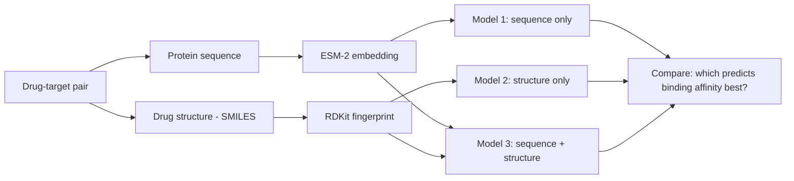

# Sequence vs. structure: what predicts drug-target binding better?

**The question:** when predicting how strongly a drug binds to a protein, does it help
more to know what the *protein* looks like (its sequence), or what the *drug* looks like
(its chemical structure) — and is combining both better than either alone?

Proteins and small molecules are described completely differently in machine learning:
a protein is usually treated as a sequence (like a sentence), a drug molecule is usually
treated as a structure (like a graph or fingerprint of its atoms and bonds). This project
builds one small model for each view, plus a combined model, and compares them directly.

## How it works

- **Sequence branch:** [ESM-2](https://github.com/facebookresearch/esm), a pretrained
  protein language model, turns each protein's amino-acid sequence into one vector.
- **Structure branch:** [RDKit](https://www.rdkit.org/) turns each drug's SMILES string
  into a Morgan fingerprint plus a few basic chemical descriptors (molecular weight,
  LogP, etc.).
- **Models:** a plain Random Forest for each feature set — kept deliberately simple, so
  any difference in results comes from the features, not from one model being fancier.
- **Data:** [Davis](https://tdcommons.ai/multi_pred_tasks/dti/#davis), a small, standard
  drug-target binding affinity benchmark (68 proteins, 442 drugs), loaded through
  [Therapeutics Data Commons](https://tdcommons.ai/).

## Running it

Open `binding_affinity_sequence_vs_structure.ipynb` in **Google Colab** with a GPU
runtime (Runtime → Change runtime type → GPU). Colab already has PyTorch and most
dependencies installed; the notebook installs the couple of things it doesn't
(`PyTDC`, `rdkit`). Run the cells top to bottom — it takes a few minutes, mostly for the
protein-embedding step.

A results chart (`results_comparison.png`) is saved at the end, comparing RMSE across
the three models.

## Why Colab and not a plain script

The protein-embedding step needs a GPU to run in reasonable time, and Colab already has
PyTorch preinstalled, so there's no setup friction — same reason all the modeling work
referenced elsewhere in my resume was also built in Colab.

## Status

Code is complete and tested end to end on a small set of real molecules and a synthetic
dry run of the model-comparison step. The full notebook still needs to be run once on
the real Davis data to fill in the actual results and the "what this tells us" section
at the bottom of the notebook.
